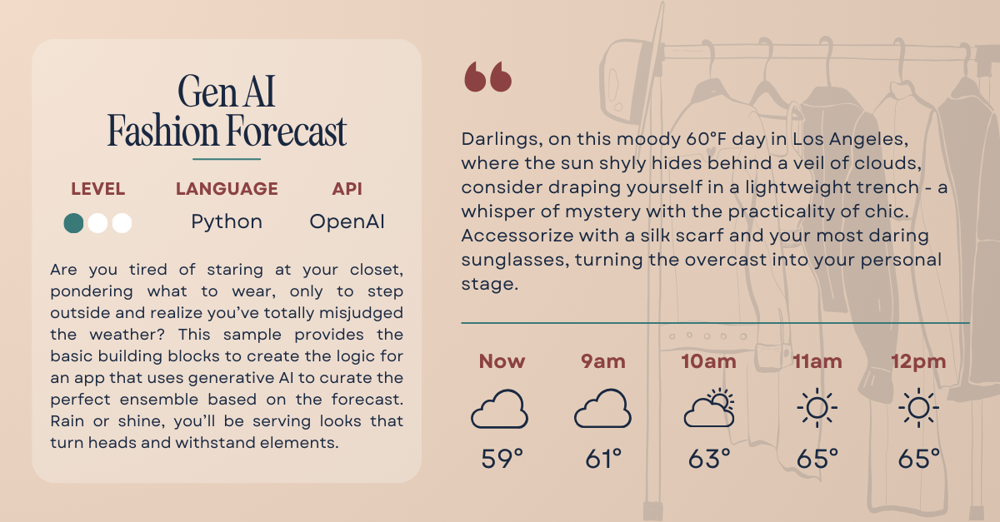

# 
Fashion Forecast

Are you tired of staring at your closet, pondering what to wear, only to step outside and realize you’ve totally misjudged the weather? This sample provides the basic building blocks to create the logic for an app that uses generative AI to curate the perfect ensemble based on the forecast. Rain or shine, you’ll be serving looks that turn heads and withstand elements!

## ✅ Requirements

- [OpenAI API](https://platform.openai.com/signup) access
- [Weather API](https://www.weatherapi.com/) access
- Code editor ([Visual Studio Code](https://code.visualstudio.com/) is always a fabulous choice!)

## 📚 Tutorial

The written tutorial for this sample will be available soon!

## 📦 Resources

- [OpenAI Developer Docs](https://platform.openai.com/docs/overview)
- [Weather API Developer Docs](https://www.weatherapi.com/docs/)

## 🚨 Contact

Have a question or issue trying the sample? Submit an issue to the repo!

